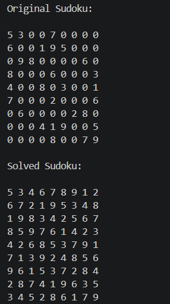

# 🧩 Sudoku Solver

A Python-based Sudoku Solver that automatically solves a 9×9 Sudoku puzzle using the Backtracking Algorithm.

---

## 🚀 Features

- Solves a 9×9 Sudoku puzzle
- Uses the Backtracking Algorithm
- Fast and efficient recursive solution
- Clean and easy-to-understand Python code

---

## 🛠️ Technologies Used

- Python 3

---

## 📂 Project Structure

```
SCT_SD_3/
│
├── sudoku_solver.py
├── README.md
└── output.png
```

---

## 📸 Output Screenshot



---

## ▶️ How to Run

1. Download or clone this repository.
2. Open the project folder.
3. Run the following command:

```bash
python sudoku_solver.py
```

or

```bash
py sudoku_solver.py
```

---

## 🧠 Algorithm Used

This project uses the **Backtracking Algorithm** to solve Sudoku by:

- Finding an empty cell.
- Trying numbers from 1 to 9.
- Checking whether the number is valid.
- Recursively solving the remaining puzzle.
- Backtracking whenever a choice leads to an invalid state.

---

## 📚 Learning Outcomes

- Python Programming
- Functions
- Recursion
- Backtracking
- 2D Lists
- Problem Solving

---

## 📄 License

This project is created for learning and internship purposes.
